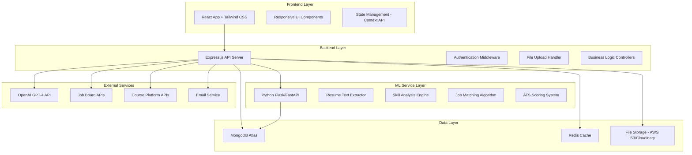

# Design Document

## Overview

Career Boost AI is designed as a modern, microservices-based web application that leverages AI and machine learning to provide comprehensive career development services. The system follows a three-tier architecture with a React frontend, Node.js backend API, and Python ML service, all connected to MongoDB for data persistence and Redis for caching.

## Architecture

### System Architecture



### Technology Stack

**Frontend:**
- React 18+ with Vite for fast development and building
- Tailwind CSS 3.4+ for utility-first styling
- shadcn/ui for consistent, accessible UI components
- Recharts for data visualization and analytics
- Framer Motion for smooth animations and transitions
- React Router v6 for client-side routing
- Axios for HTTP requests with interceptors

**Backend:**
- Node.js 18+ with Express.js framework
- JWT-based authentication with Passport.js
- Multer for file upload handling
- Joi for request validation
- Winston for structured logging
- Helmet.js for security headers

**ML Service:**
- Python Flask/FastAPI for ML API endpoints
- spaCy 3.x for natural language processing
- Sentence-Transformers for semantic embeddings
- PyMuPDF for PDF text extraction
- python-docx for Word document parsing
- scikit-learn for machine learning algorithms

**Database & Storage:**
- MongoDB Atlas for primary data storage
- Redis for session management and caching
- AWS S3 or Cloudinary for resume file storage

## Components and Interfaces

### Frontend Components

#### Core Layout Components
- **Navbar**: Responsive navigation with user avatar, notifications, and mobile hamburger menu
- **Sidebar**: Collapsible navigation for dashboard pages with active state indicators
- **Footer**: Links, social media, and company information

#### Resume Analysis Components
- **UploadResume**: Drag-and-drop file upload with progress indicators and validation
- **ResumePreview**: Clean text display of extracted resume content with formatting
- **ATSScoreCard**: Circular gauge showing ATS score with color-coded grades and breakdown
- **SkillExtractor**: Interactive skill tags with categories and proficiency indicators

#### Job Recommendation Components
- **JobCard**: Company logo, match percentage, key details, and save functionality
- **JobFilters**: Sidebar with location, salary, experience, and work mode filters
- **JobMatchList**: Paginated grid of job cards with sorting options

#### Learning Path Components
- **LearningPath**: Visual roadmap with skill nodes and progress tracking
- **CourseCard**: Course thumbnail, platform, duration, price, and enrollment button
- **ProgressTracker**: Circular progress rings and completion statistics

#### Dashboard Components
- **Analytics**: Summary cards with key metrics and trend indicators
- **SkillRadar**: Interactive radar chart showing skill coverage
- **ProfileSummary**: Overall strength score and improvement recommendations

#### Common Components
- **Button**: Variants for primary, secondary, outline, and icon buttons
- **Input**: Floating labels, validation states, and accessibility features
- **Modal**: Backdrop blur, animation, and keyboard navigation
- **Toast**: Success, error, and info notifications with auto-dismiss
- **Loader**: Skeleton screens and spinner components

### Backend API Structure

#### Authentication Endpoints
```javascript
// Authentication routes with JWT and social login
POST /api/auth/signup
POST /api/auth/login
POST /api/auth/logout
POST /api/auth/forgot-password
POST /api/auth/reset-password
GET /api/auth/verify-email/:token
```

#### Resume Analysis Endpoints
```javascript
// Resume processing with ML service integration
POST /api/resume/upload        // Multipart file upload
POST /api/resume/analyze       // Trigger ML analysis
GET /api/resume/history        // User's analysis history
GET /api/resume/:id           // Specific analysis results
DELETE /api/resume/:id        // Remove analysis
```

#### Job Matching Endpoints
```javascript
// Job recommendations and management
GET /api/jobs                 // Filtered job listings
GET /api/jobs/:id            // Job details
POST /api/jobs/match         // Generate recommendations
POST /api/jobs/save/:id      // Save job to favorites
GET /api/jobs/saved          // User's saved jobs
```

### ML Service Architecture

#### Text Processing Pipeline
```python
class ResumeProcessor:
    def __init__(self):
        self.nlp = spacy.load("en_core_web_sm")
        self.sentence_model = SentenceTransformer('all-MiniLM-L6-v2')
        
    def extract_text(self, file_path, file_type):
        """Extract text from PDF or DOCX files"""
        if file_type == 'pdf':
            return self._extract_pdf_text(file_path)
        elif file_type == 'docx':
            return self._extract_docx_text(file_path)
            
    def analyze_skills(self, text):
        """Extract and categorize skills using NLP"""
        doc = self.nlp(text)
        skills = self._match_skills_database(doc)
        return self._categorize_skills(skills)
        
    def calculate_ats_score(self, text, job_keywords=None):
        """Calculate ATS compatibility score"""
        return {
            'total_score': self._compute_total_score(text),
            'breakdown': self._score_breakdown(text),
            'suggestions': self._generate_suggestions(text)
        }
```

#### Job Matching Algorithm
```python
class JobMatcher:
    def __init__(self):
        self.model = SentenceTransformer('all-MiniLM-L6-v2')
        
    def match_jobs(self, resume_embedding, job_embeddings, filters):
        """Find best matching jobs using cosine similarity"""
        similarities = cosine_similarity([resume_embedding], job_embeddings)
        scored_jobs = self._apply_filters_and_boost(similarities, filters)
        return sorted(scored_jobs, key=lambda x: x['score'], reverse=True)[:20]
```

## Data Models

### User Model
```javascript
const userSchema = {
  _id: ObjectId,
  email: String, // unique, required
  password: String, // hashed with bcrypt
  profile: {
    firstName: String,
    lastName: String,
    phone: String,
    location: String,
    linkedinUrl: String,
    targetRoles: [String],
    experienceLevel: String, // Entry, Mid, Senior
    preferredLocations: [String],
    workModePreference: String, // Remote, Hybrid, Onsite
    salaryRange: {
      min: Number,
      max: Number,
      currency: String
    }
  },
  preferences: {
    notifications: {
      email: Boolean,
      jobAlerts: Boolean,
      learningReminders: Boolean
    },
    privacy: {
      profileVisible: Boolean,
      shareAnalytics: Boolean
    }
  },
  subscription: {
    plan: String, // Free, Premium
    expiresAt: Date
  },
  createdAt: Date,
  updatedAt: Date,
  lastLoginAt: Date,
  emailVerified: Boolean,
  isActive: Boolean
}
```

### Resume Analysis Model
```javascript
const resumeAnalysisSchema = {
  _id: ObjectId,
  userId: ObjectId, // Reference to User
  originalFileName: String,
  fileUrl: String, // S3/Cloudinary URL
  extractedText: String,
  analysis: {
    atsScore: {
      totalScore: Number, // 0-100
      breakdown: {
        keywordMatch: Number,
        contactInfo: Number,
        structure: Number,
        formatting: Number,
        quantifiable: Number
      },
      grade: String, // A+, A, B, C, D
      suggestions: [String]
    },
    skills: {
      technical: [{
        name: String,
        category: String, // Programming, Framework, Tool
        proficiency: String, // Beginner, Intermediate, Advanced
        yearsExperience: Number
      }],
      soft: [{
        name: String,
        evidence: [String] // Context where skill was found
      }],
      certifications: [{
        name: String,
        issuer: String,
        dateObtained: Date,
        expirationDate: Date
      }]
    },
    experience: {
      totalYears: Number,
      positions: [{
        title: String,
        company: String,
        duration: String,
        responsibilities: [String]
      }]
    },
    education: [{
      degree: String,
      institution: String,
      graduationYear: Number,
      gpa: Number
    }]
  },
  createdAt: Date,
  updatedAt: Date
}
```

### Job Model
```javascript
const jobSchema = {
  _id: ObjectId,
  title: String,
  company: {
    name: String,
    logo: String,
    size: String, // Startup, Small, Medium, Large
    industry: String
  },
  description: String,
  requirements: {
    skills: [String],
    experience: {
      min: Number,
      max: Number
    },
    education: String,
    certifications: [String]
  },
  details: {
    location: String,
    workMode: String, // Remote, Hybrid, Onsite
    employmentType: String, // Full-time, Part-time, Contract
    salaryRange: {
      min: Number,
      max: Number,
      currency: String
    }
  },
  embedding: [Number], // Sentence transformer embedding
  source: String, // LinkedIn, Indeed, Glassdoor
  externalUrl: String,
  postedDate: Date,
  applicationDeadline: Date,
  isActive: Boolean,
  createdAt: Date,
  updatedAt: Date
}
```

### Application Tracking Model
```javascript
const applicationSchema = {
  _id: ObjectId,
  userId: ObjectId,
  jobId: ObjectId, // Reference to Job
  status: String, // Applied, Interview, Offer, Rejected
  appliedDate: Date,
  notes: String,
  interviews: [{
    type: String, // Phone, Video, Onsite
    scheduledDate: Date,
    interviewer: String,
    notes: String,
    outcome: String
  }],
  documents: {
    resumeUrl: String,
    coverLetterUrl: String,
    customDocuments: [String]
  },
  followUpReminders: [{
    date: Date,
    message: String,
    completed: Boolean
  }],
  createdAt: Date,
  updatedAt: Date
}
```

## Error Handling

### Frontend Error Handling
- **Network Errors**: Retry mechanism with exponential backoff
- **Validation Errors**: Real-time form validation with clear error messages
- **File Upload Errors**: Progress indicators with error states and retry options
- **Authentication Errors**: Automatic token refresh and redirect to login
- **Global Error Boundary**: Catch React component errors and display fallback UI

### Backend Error Handling
```javascript
// Centralized error handling middleware
const errorHandler = (err, req, res, next) => {
  const error = {
    message: err.message,
    status: err.status || 500,
    timestamp: new Date().toISOString(),
    path: req.path,
    method: req.method
  };
  
  // Log error for monitoring
  logger.error(error);
  
  // Send appropriate response
  res.status(error.status).json({
    success: false,
    error: process.env.NODE_ENV === 'production' 
      ? 'Internal server error' 
      : error.message
  });
};
```

### ML Service Error Handling
- **File Processing Errors**: Graceful handling of corrupted or password-protected files
- **Model Loading Errors**: Fallback to cached results or simplified analysis
- **API Rate Limiting**: Queue system for high-volume requests
- **Timeout Handling**: Async processing with status updates

## Testing Strategy

### Frontend Testing
- **Unit Tests**: Jest and React Testing Library for component testing
- **Integration Tests**: Test user flows and API integration
- **E2E Tests**: Playwright for critical user journeys
- **Visual Regression**: Chromatic for UI consistency
- **Accessibility Tests**: axe-core for WCAG compliance

### Backend Testing
- **Unit Tests**: Jest for individual functions and middleware
- **Integration Tests**: Supertest for API endpoint testing
- **Database Tests**: In-memory MongoDB for isolated testing
- **Security Tests**: OWASP ZAP for vulnerability scanning
- **Load Tests**: Artillery for performance testing

### ML Service Testing
- **Model Tests**: Validate accuracy on test datasets
- **API Tests**: Test all ML endpoints with various inputs
- **Performance Tests**: Measure processing time and memory usage
- **Data Quality Tests**: Validate extracted text and skill accuracy

### Test Data Management
- **Seed Data**: Consistent test datasets for development and testing
- **Mock Services**: Mock external APIs for reliable testing
- **Test Isolation**: Each test runs with clean database state
- **CI/CD Integration**: Automated testing on every pull request

## Security Considerations

### Authentication & Authorization
- JWT tokens with short expiration and refresh mechanism
- Password hashing using bcrypt with salt rounds
- Rate limiting on authentication endpoints
- Account lockout after failed login attempts
- Email verification for new accounts

### Data Protection
- Input sanitization and validation on all endpoints
- SQL injection prevention through parameterized queries
- XSS protection with content security policy
- File upload validation (type, size, malware scanning)
- Encryption of sensitive data at rest

### API Security
- CORS configuration for allowed origins
- Helmet.js for security headers
- Request size limits to prevent DoS attacks
- API versioning for backward compatibility
- Audit logging for sensitive operations

### Infrastructure Security
- HTTPS enforcement in production
- Environment variable management for secrets
- Regular dependency updates and vulnerability scanning
- Database connection encryption
- Backup and disaster recovery procedures